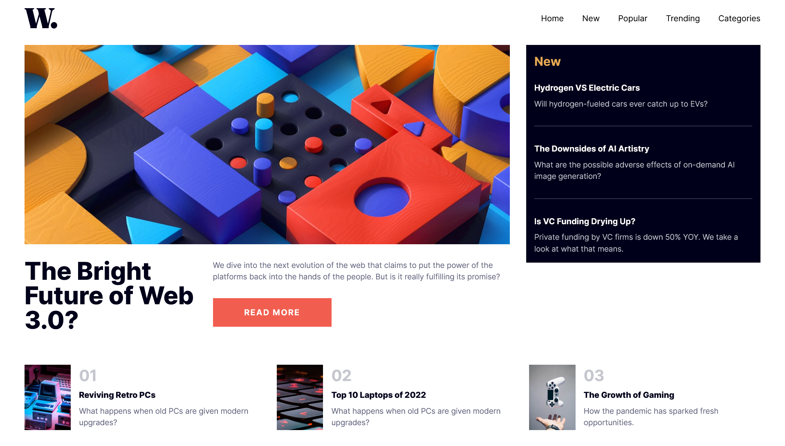
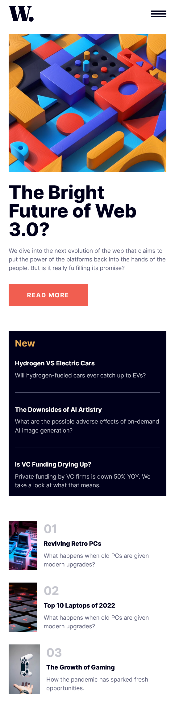
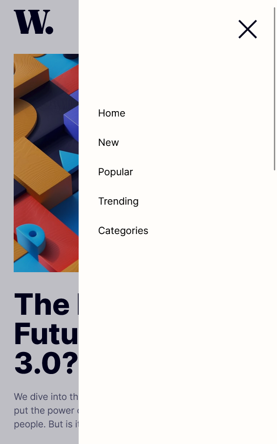

## Overview

### The challenge

Users should be able to:

- View the optimal layout for the interface depending on their device's screen size
- See hover and focus states for all interactive elements on the page
- **Bonus**: Toggle the mobile menu (requires some JavaScript)

### Screenshot





### Links

- Live site preview: [https://news-homepage-tw.netlify.app/](https://news-homepage-tw.netlify.app/)

## My process

### Built with

- Grid
- Flexbox
- Image assets belongs to [frontendmentor](https://www.frontendmentor.io/)
- [React](https://reactjs.org/) - JS library
- [Tailwindcss](https://tailwindcss.com/) - CSS Framework

### What I learned

- mobile first responsive designing approach
- Tailwind grid, flex box
- A solution a for prop drilling in react ---> context API
- How to create custom hooks

# Created using vite

[viteJs](https://vitejs.dev/)

```
  npm install
  npm run dev
```
